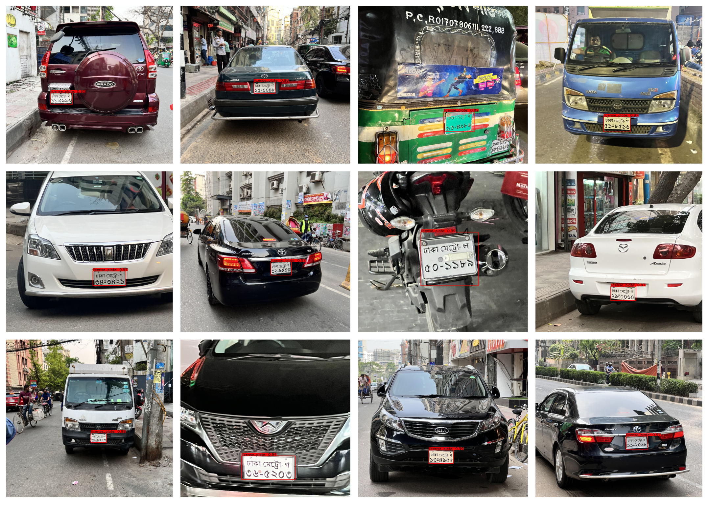
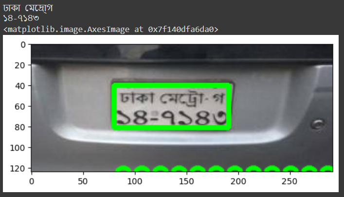

# Automatic Bangla License Plate Recognition System for Low-Resolution Images
This repository contains code for training a super-resolution model for enhancing the resolution of Bangla license plate images. The model is implemented using TensorFlow and Keras.

## Base Project
https://github.com/zzxvictor/License-super-resolution

## Reference 
[Naimul Haque et al., 2022] Naimul Haque, Samira Islam, Rabeiya Afrose Tithy, and Mohammad Shorif Uddin. "Automatic Bangla License Plate Recognition System for Low-Resolution Images." *2022 4th International Conference on Sustainable Technologies for Industry 4.0 (STI)*, 2022. DOI: [10.1109/STI56238.2022.10103289](https://doi.org/10.1109/STI56238.2022.10103289).

## Table of Contents

* Introduction
* Dataset
* Setup
* Training
* 

## Introduction
((Follow the Inference notebook))
The goal of this project is to improve the resolution of Bangla license plate images using a super-resolution model. The model is trained using a combination of mean absolute error (MAE) loss and VGG loss. The training process involves pretraining the generator model and then training the generative adversarial network (GAN).

## Dataset 
### Bangla-License-Plate-Dataset-2.5k

### Author: Naimul Haque; Mirajul Islam; Afrose Tithy; Samira Islam

This comprehensive dataset of 2519 Bangladeshi vehicle images with clearly legible Bangla license plates. The dataset contains preprocessed license plate images for detection and recognition systems.

### Download: [zenodo: Bangla License Plate Dataset 2.5k](https://zenodo.org/record/7110401#%23.Y2kp5tJByC1)
Upon downloading, you will get four directories:

1. training: Contains 2211 high-resolution Bangla license plate images of variable sizes cropped from pictures with license plates. All the files are in jpg format.

2. training_data: Contains 2211 Bangla license plate images of ‪256 x 192‬ size, resized from images from the training directory. All the files are in png format.

3. testing: Contains 200 high-resolution Bangla license plate images of variable sizes cropped from pictures with license plates. All the files are in jpg format.

4. training_data: Contains 200 Bangla license plate images of ‪256 x 192‬ size, resized from images from the testing directory. All the files are in png format. 

5. new data: Contains extra 308 images of variable size, 

## Preview



## Citation
@dataset{naimul_haque_2022_7110401,
  author       = {Naimul Haque and
                  Mirajul Islam and
                  Afrose Tithy and
                  Samira Islam},
  title        = {Bangla License Plate Dataset 2.5k},
  month        = sep,
  year         = 2022,
  publisher    = {Zenodo},
  doi          = {10.5281/zenodo.7110401},
  url          = {https://doi.org/10.5281/zenodo.7110401}
}

## Training
Follow the notebook: Train_final.ipynb.
To train the super-resolution model, follow these steps:
1. Load the training dataset by running the following code:
```python
import numpy as np
import glob

PATH = '/content/drive/MyDrive/Processed_data/training_data'
files = glob.glob(PATH + '/*.png') * 3  # data augmentation, same image with different brightness and contrast
np.random.shuffle(files)
train, val = files[:int(len(files)*0.8)], files[int(len(files)*0.8):]
loader = DataLoader()
trainData = DataLoader().load(train, batchSize=16)
valData = DataLoader().load(val, batchSize=64)

```
2. Define the generator, discriminator, and extractor models:
```python
discriminator = Discriminator()
extractor = buildExtractor()
generator = RRDBNet(blockNum=10)

```
3. Pretrain the generator model:
```python
def contentLoss(y_true, y_pred):
    featurePred = extractor(y_pred)
    feature = extractor(y_true)
    mae = tf.reduce_mean(tfk.losses.mae(y_true, y_pred))
    return 0.1*tf.reduce_mean(tfk.losses.mse(featurePred, feature)) + mae

optimizer = tfk.optimizers.Adam(learning_rate=1e-3)
generator.compile(loss=contentLoss, optimizer=optimizer, metrics=[psnr, ssim])
history = generator.fit(x=trainData, validation_data=valData, epochs=5, steps_per_epoch=300, validation_steps=100)
```
4. Train the generative adversarial network (GAN):
```python
PARAMS = dict(lrGenerator=1e-4, lrDiscriminator=1e-4, epochs=2, stepsPerEpoch=500, valSteps=100)
game = MinMaxGame(generator, discriminator, extractor)
log, valLog = game.train(trainData, valData, PARAMS)
```

## Inference

This notebook performs text recognition and localization using EasyOCR library. It reads an image, applies various image processing techniques to localize the text, and uses EasyOCR to extract the text from the localized region. The recognized text is then rendered back onto the image.

## Dependencies

The following dependencies need to be installed before running the notebook:

- `easyocr`
- `imutils`
- `cv2` (OpenCV)
- `matplotlib`
- `numpy`
- `tensorflow`
- `keras`
- `google.colab`

You can install the required dependencies by running the following commands:

```python
!pip install easyocr
!pip install imutils
```
### Result



